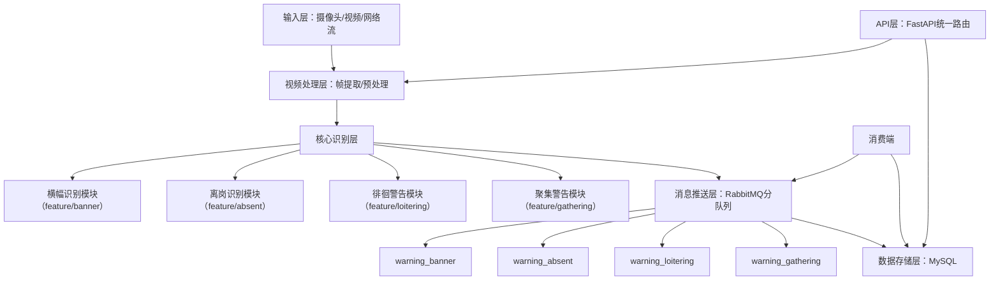
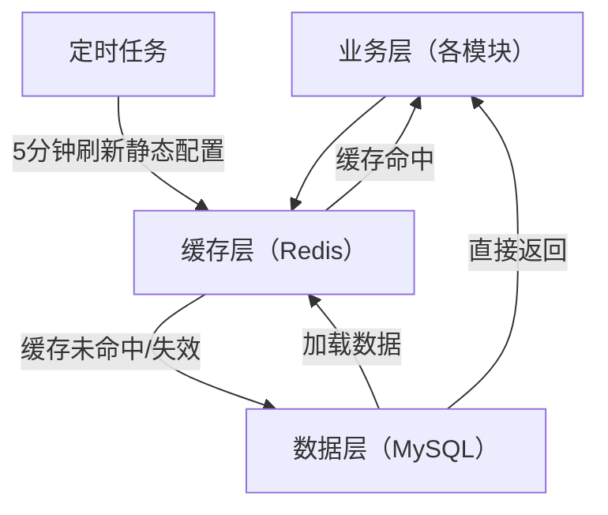

# 一、总项目PRD（用于创建项目框架）
## Abnormal-Behavior-Recognition-System (ABRS) 总PRD
### 1. 仓库与项目基础信息
| 项               | 内容                                                                 |
|------------------|----------------------------------------------------------------------|
| 仓库名称         | Abnormal-Behavior-Recognition-System-ABRS                            |
| 项目名称         | 异常行为识别系统                                                     |
| 英文名称         | Abnormal Behavior Recognition System (ABRS)                          |
| 版本             | V1.0                                                                 |
| 核心模块         | 横幅识别、离岗识别、徘徊警告、聚集警告                               |
| 输入源           | 本地摄像头 / 本地视频文件（MP4/AVI） / RTSP/HTTP-FLV网络视频流       |
| 技术栈           | Python3.11 + FastAPI + YOLOv12 + ByteTrack + PaddleOCR + MySQL + RabbitMQ |
| 环境管理         | conda（environment.yml）+ requirements.txt 兼容                     |
| Git分支策略      | main（主分支）+ dev（开发分支）+ feature/xxx（模块特性分支）         |

### 2. 项目整体架构


### 3. 项目核心目标
基于计算机视觉技术，构建一套可扩展、模块化的异常行为识别系统：
- 支持多输入源实时检测，覆盖横幅违规、人员离岗、区域徘徊、人员聚集四类核心异常行为；
- 各模块独立开发、独立测试，通过统一的API/数据规范整合至总系统；
- 告警信息通过RabbitMQ分队列推送，核心数据持久化至MySQL，支持告警查询、统计与溯源。

### 4. 总项目目录框架（适配Git仓库）
```
Abnormal-Behavior-Recognition-System-ABRS/
├── README.md                     # 总项目说明（仓库级）
├── PRD/                          # PRD目录（总+模块）
│   ├── ABRS_总PRD.md             # 本总PRD文件
│   ├── module_banner_PRD.md      # 横幅识别模块PRD
│   ├── module_absent_PRD.md      # 离岗识别模块PRD
│   ├── module_loitering_PRD.md   # 徘徊警告模块PRD
│   └── module_gathering_PRD.md   # 聚集警告模块PRD
├── environment.yml               # 统一环境配置
├── requirements.txt              # 统一依赖配置
├── init_db.py                    # 总数据库初始化（含所有模块表）
├── run.py                        # 总项目启动入口（整合所有模块）
├── config/                       # 全局配置
│   ├── __init__.py
│   ├── db_config.py              # MySQL全局配置
│   ├── rabbitmq_config.py        # RabbitMQ全局配置
│   └── app_config.py             # 全局应用配置
├── api/                          # 统一API路由
│   ├── __init__.py
│   └── v1/
│       ├── __init__.py
│       ├── source.py             # 全局输入源管理
│       ├── banner.py             # 横幅模块接口
│       ├── absent.py             # 离岗模块接口
│       ├── loitering.py          # 徘徊模块接口
│       ├── gathering.py          # 聚集模块接口
│       └── alarm.py              # 全局告警查询
├── core/                         # 核心模块逻辑（按模块分包）
│   ├── __init__.py
│   ├── video_processor.py        # 全局视频处理
│   ├── banner/                   # 横幅模块核心
│   ├── absent/                   # 离岗模块核心
│   ├── loitering/                # 徘徊模块核心
│   └── gathering/                # 聚集模块核心
├── models/                       # 全局ORM模型
│   ├── __init__.py
│   ├── base.py                   # 模型基类
│   ├── video_source.py           # 全局输入源模型
│   ├── banner.py                 # 横幅模块模型
│   ├── absent.py                 # 离岗模块模型
│   ├── loitering.py              # 徘徊模块模型
│   └── gathering.py              # 聚集模块模型
├── utils/                        # 全局工具类
│   ├── __init__.py
│   ├── db_utils.py               # 数据库工具
│   ├── rabbitmq_utils.py         # MQ工具
│   ├── video_utils.py            # 视频工具
│   └── common_utils.py           # 通用工具
├── static/                       # 全局静态资源
├── logs/                         # 全局日志
└── scripts/                      # 辅助脚本（分支合并、环境检查等）
```

### 5. 模块整合规范
| 模块         | 分支名称          | 核心标识       | 独立端口（开发期） | 整合后路由前缀       | RabbitMQ队列         |
|--------------|-------------------|----------------|--------------------|----------------------|----------------------|
| 横幅识别     | feature/banner    | event_id=01    | 8001               | /api/v1/banner       | warning_banner       |
| 离岗识别     | feature/absent    | event_id=02    | 8002               | /api/v1/absent       | warning_absent       |
| 徘徊警告     | feature/loitering | event_id=03    | 8003               | /api/v1/loitering    | warning_loitering    |
| 聚集警告     | feature/gathering | event_id=04    | 8004               | /api/v1/gathering    | warning_gathering    |

### 6. 非功能需求（全局）
- **兼容性**：各模块依赖版本统一，环境配置文件（environment.yml/requirements.txt）唯一；
- **可扩展性**：新增模块仅需新增feature分支，遵循统一的API/数据规范即可接入；
- **可靠性**：所有RabbitMQ队列/消息持久化，数据库操作异常重试；
- **可维护性**：模块代码按目录隔离，日志按模块分类输出。

# 二、规范的Git操作流程（适配ABRS总仓库）
## 1. 仓库初始化（第一步）
```bash
# 1. 克隆远程仓库到本地
git clone https://github.com/你的用户名/Abnormal-Behavior-Recognition-System-ABRS.git
cd Abnormal-Behavior-Recognition-System-ABRS

# 2. 创建dev开发分支（主分支仅用于发布，开发在dev分支）
git checkout -b dev
git push -u origin dev

# 3. 创建PRD目录并提交总PRD（初始化仓库框架）
mkdir PRD
# 将总PRD和各模块PRD放入PRD目录
git add PRD/ README.md
git commit -m "feat: 初始化项目PRD，创建总PRD和模块PRD目录"
git push origin dev
```

## 2. 模块开发分支管理（核心步骤）
### （1）创建模块特性分支（基于dev分支）
```bash
# 离岗识别模块
git checkout dev
git checkout -b feature/absent
git push -u origin feature/absent

# 徘徊警告模块
git checkout dev
git checkout -b feature/loitering
git push -u origin feature/loitering

# 聚集警告模块
git checkout dev
git checkout -b feature/gathering
git push -u origin feature/gathering
```

### （2）模块开发与提交规范
```bash
# 进入对应模块分支开发
git checkout feature/absent

# 开发过程中提交代码（遵循Conventional Commits规范）
# 提交类型：feat（新增功能）/fix（修复bug）/docs（文档）/style（格式）/refactor（重构）
git add .
git commit -m "feat(absent): 完成离岗识别核心逻辑，支持本地摄像头输入"
git push origin feature/absent
```

### （3）模块测试与提PR（合并到dev分支）
1. 模块开发完成后，在GitHub仓库页面，针对`feature/absent`分支创建**Pull Request (PR)**，目标分支选择`dev`；
2. 进行代码审查（Code Review），确认无问题后合并PR；
3. 合并后删除远程`feature/absent`分支（本地可保留）：
   ```bash
   git checkout dev
   git pull origin dev
   git branch -d feature/absent  # 删除本地分支
   git push origin --delete feature/absent  # 删除远程分支
   ```
4. 其他模块（loitering/gathering）重复上述步骤，均合并至dev分支。

## 3. 总项目整合与发布（合并到main分支）
```bash
# 1. 所有模块合并到dev分支后，测试总项目完整性
git checkout dev
git pull origin dev
# 运行总项目，测试各模块功能、接口、MQ队列是否正常

# 2. 测试通过后，创建PR将dev分支合并到main分支（发布版本）
# GitHub页面操作：dev → main，提PR并合并

# 3. 合并后，在main分支打Tag（版本标记）
git checkout main
git pull origin main
git tag -a v1.0 -m "ABRS v1.0 发布：包含横幅/离岗/徘徊/聚集四大模块"
git push origin v1.0
```

## 4. Git操作规范补充
### （1）提交信息规范（强制）
```
<类型>(<模块>): <描述>

[可选：详细说明]
```
示例：
- `feat(absent): 新增离岗告警RabbitMQ推送逻辑`
- `fix(loitering): 修复徘徊时长统计误差问题`
- `docs(gathering): 完善聚集模块PRD文档`

### （2）分支命名规范
| 分支类型   | 命名格式          | 示例               |
|------------|-------------------|--------------------|
| 主分支     | main              | main               |
| 开发分支   | dev               | dev                |
| 特性分支   | feature/模块名    | feature/absent     |
| 修复分支   | bugfix/问题描述   | bugfix/absent_timer |

### （3）代码合并规范
- 禁止直接向main分支推送代码，所有修改必须通过PR合并；
- 模块分支仅合并至dev分支，dev分支测试稳定后再合并至main分支；
- 每次合并前必须保证代码可运行，无语法错误、依赖缺失。

# 三、总PRD需新增的Redis缓存内容（直接追加到总PRD中）
## 新增章节：3. 全局缓存层设计（Redis）
### 3.1 缓存层基础信息
| 项               | 内容                                                                 |
|------------------|----------------------------------------------------------------------|
| 技术选型         | Redis 6.2+（支持RDB+AOF持久化、过期策略、分布式锁）                   |
| 客户端           | redis-py（Python核心客户端）+ fastapi-cache2（可选，接口缓存装饰器）  |
| 部署模式         | 单机模式（开发/测试）/主从模式（生产）                                |
| 键命名规范       | 统一前缀：`abrs:` + 模块标识 + 业务类型 + 唯一ID<br>示例：`abrs:absent:person:P001` |
| 核心原则         | 1. 缓存降级：Redis故障时自动降级至MySQL查询，不影响核心检测；<br>2. 按需缓存：仅缓存高频读写数据，避免内存浪费；<br>3. 数据一致性：缓存更新/过期策略保证与MySQL数据一致 |

### 3.2 全局缓存架构


### 3.3 全局缓存策略
| 缓存类型       | 刷新策略                          | 过期时间                | 适用场景                          |
|----------------|-----------------------------------|-------------------------|-----------------------------------|
| 静态配置缓存   | 全量加载+定时刷新（5分钟）+ 更新时主动刷新 | 300秒（5分钟）| 人员配置、区域配置、违规词库、输入源配置 |
| 实时状态缓存   | 实时更新（检测逻辑触发）| 10秒（避免脏数据）| 离岗计时、区域人数统计、徘徊时长   |
| 限流缓存       | 触发时设置                        | 按业务规则（如300秒）| 告警频率限流、重复请求限流         |
| 分布式锁缓存   | 加锁时设置                        | 10秒（避免死锁）| 多实例并发修改配置/状态           |

### 3.4 缓存层非功能需求
- **性能**：缓存读取延迟≤1ms，写入延迟≤5ms；
- **可靠性**：Redis故障时，模块核心功能（检测/告警）不受影响，自动降级至MySQL；
- **数据一致性**：静态配置更新后，缓存同步刷新（延迟≤10s）；实时状态缓存过期后自动失效，避免脏数据。
