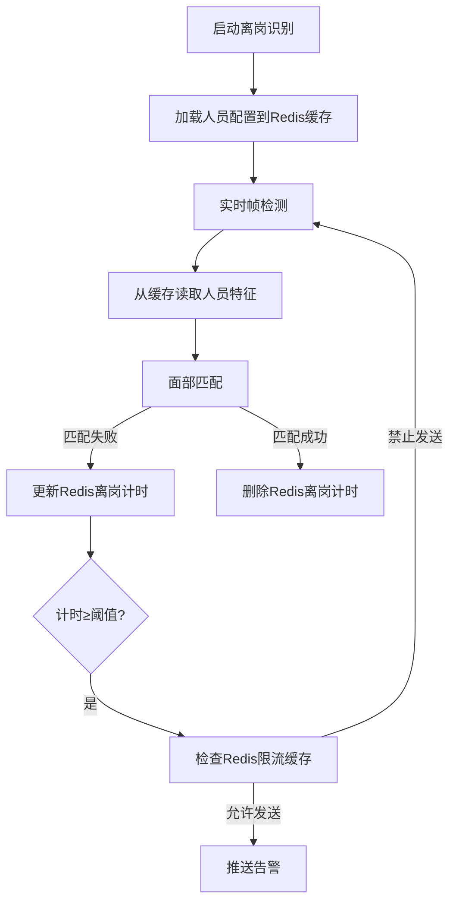

# 一、离岗识别模块（Absenteeism Recognition Module）独立项目PRD
## 1. 基本信息
| 项               | 内容                                                                 |
|------------------|----------------------------------------------------------------------|
| 项目名称         | 离岗识别模块项目                                                     |
| 英文名称         | Absenteeism Recognition Project                                     |
| 版本             | V1.0                                                                 |
| 事件编号         | 02                                                                   |
| RabbitMQ队列     | `warning_absent`（持久化队列）                                        |
| 输入源           | 本地摄像头 / 本地视频文件（MP4/AVI） / RTSP/HTTP-FLV网络视频流       |
| 技术栈           | Python3.11 + FastAPI + YOLOv12 + ByteTrack + 面部识别 + MySQL + RabbitMQ |
| 环境管理         | conda（environment.yml）+ requirements.txt 兼容                     |
| 项目定位         | 独立子项目，负责人员在岗/离岗检测与告警，后续可无缝集成至总异常行为识别系统 |

## 2. 项目概述
本项目为异常行为识别系统的核心子项目，专注于**站岗人员在岗状态实时监测**：支持多输入源（本地摄像头/本地视频/网络流）检测，通过面部识别匹配人员身份，结合预设站岗时间段与允许离岗时长，实现离岗分级告警与回岗时长统计，告警信息通过RabbitMQ可靠推送，核心数据持久化至MySQL，为整体系统提供离岗异常行为的检测能力。

## 3. 核心功能需求
### 3.1 输入源适配（多模式支持）
| 输入类型       | 具体要求                                                                 |
|----------------|--------------------------------------------------------------------------|
| 本地摄像头     | 支持通过设备ID（如0/1）选择本地摄像头，实时拉取帧流（默认10fps/1080P），支持帧率/分辨率配置 |
| 本地视频文件   | 支持MP4/AVI格式视频上传，按帧解析检测，支持进度回溯与断点续测             |
| 网络视频流     | 支持RTSP/HTTP-FLV协议流地址配置，实时拉取帧流，支持断线重连             |
| 输入源切换     | 提供API `/api/v1/absent/source/switch`，支持三种输入源一键切换，切换后实时生效 |

### 3.2 人员信息与规则管理
| 功能点         | 具体要求                                                                 |
|----------------|--------------------------------------------------------------------------|
| 面部信息录入   | 支持上传1张人员面部图片，提取特征值并Base64编码存储，支持特征值更新覆盖   |
| 身份信息绑定   | 录入唯一人员工号（person_id）、姓名、岗位名称，与面部特征值一一绑定       |
| 站岗规则配置   | 为每个人员配置：<br>① 单段站岗时间段（格式：HH:MM-HH:MM，如08:00-18:00）<br>② 允许最长离岗时间（分钟，默认5，可自定义） |
| 信息管理接口   | 提供增删改查API：<br>- `/api/v1/absent/person/add`（新增）<br>- `/api/v1/absent/person/update`（修改）<br>- `/api/v1/absent/person/delete`（删除）<br>- `/api/v1/absent/person/query`（查询） |

### 3.3 在岗/离岗判定逻辑
| 判定场景       | 具体规则                                                                 |
|----------------|--------------------------------------------------------------------------|
| 在岗判定       | 站岗时间段内，视频帧中识别到人员面部匹配 → 标记“在岗”，重置离岗计时       |
| 离岗判定       | 连续未识别到匹配面部的时长 ≥ 允许最长离岗时间 → 标记“离岗”，触发首次告警 |
| 回岗判定       | 离岗状态下，重新识别到匹配面部 → 标记“回岗”，触发告警解除并统计时长       |

### 3.4 告警规则与输出
| 告警类型       | 触发时机                                                                 | 输出要求                                                                 |
|----------------|--------------------------------------------------------------------------|--------------------------------------------------------------------------|
| 首次离岗告警   | 离岗状态触发时（达到允许最长离岗时间）                                   | 推送至`warning_absent`队列，消息格式见下方JSON示例                       |
| 持续离岗告警   | 首次告警后，离岗状态每持续5分钟                                         | 推送至`warning_absent`队列，`alarm_type`为“离岗持续告警”，新增`alarm_interval`字段（如“距首次告警5分钟”） |
| 离岗解除告警   | 人员回岗时                                                               | 推送至`warning_absent`队列，`alarm_type`为“离岗告警解除”，补充`absent_start`/`return_time`/`total_absent_seconds`字段 |

#### 告警消息格式（JSON示例）
```json
{
  "alarm_time": "2026-03-23 14:30:00",
  "event_id": "02",
  "alarm_type": "离岗首次告警",
  "content": {
    "person_id": "P001",
    "person_name": "张三",
    "post": "北门岗",
    "duty_period": "08:00-18:00",
    "allowed_max_min": 5,
    "current_absent_sec": 300,
    "source_type": "camera",
    "source_id": "CAM01"
  },
  "message_id": "uuid-abc123"
}
```

## 4. API接口设计（独立项目）
| 接口路径                          | 方法 | 功能               | 请求参数示例                                                                 |
|-----------------------------------|------|--------------------|------------------------------------------------------------------------------|
| `/api/v1/absent/person/add`       | POST | 新增离岗人员       | `{"person_id":"P001","name":"张三","post":"北门岗","duty_period":"08:00-18:00","max_absent_min":5,"face_img":"base64编码"}` |
| `/api/v1/absent/person/update`    | POST | 修改人员信息       | `{"person_id":"P001","max_absent_min":10}`                                   |
| `/api/v1/absent/person/delete`    | POST | 删除人员信息       | `{"person_id":"P001"}`                                                       |
| `/api/v1/absent/person/query`     | GET  | 查询人员列表       | `?person_id=P001`                                                           |
| `/api/v1/absent/source/switch`    | POST | 切换输入源         | `{"source_type":"camera","source_id":"CAM01","device_id":0}`                |
| `/api/v1/absent/start`            | POST | 启动离岗识别       | `{"source_id":"CAM01"}`                                                     |
| `/api/v1/absent/stop`             | POST | 停止离岗识别       | -                                                                            |
| `/api/v1/absent/alarm/list`       | GET  | 查询告警记录       | `?person_id=P001&start_time=2026-03-01&end_time=2026-03-23`                 |

## 5. 数据库设计（独立项目表结构）
```sql
-- 人员信息表（核心业务表）
CREATE TABLE `t_person` (
  `id` int NOT NULL AUTO_INCREMENT COMMENT '自增ID',
  `person_id` varchar(20) NOT NULL COMMENT '人员工号（唯一）',
  `name` varchar(50) NOT NULL COMMENT '姓名',
  `post` varchar(50) NOT NULL COMMENT '岗位',
  `duty_period` varchar(50) NOT NULL COMMENT '站岗时间段',
  `max_absent_min` int DEFAULT 5 COMMENT '允许最长离岗时间（分钟）',
  `face_feature` text COMMENT '面部特征值（Base64编码）',
  `create_time` datetime DEFAULT CURRENT_TIMESTAMP COMMENT '创建时间',
  PRIMARY KEY (`id`),
  UNIQUE KEY `uk_person_id` (`person_id`)
) ENGINE=InnoDB DEFAULT CHARSET=utf8mb4 COMMENT='离岗人员信息表';

-- 输入源配置表（与总系统兼容）
CREATE TABLE `t_video_source` (
  `id` int NOT NULL AUTO_INCREMENT COMMENT '自增ID',
  `source_id` varchar(20) NOT NULL COMMENT '输入源编号',
  `source_name` varchar(50) NOT NULL COMMENT '输入源名称',
  `source_type` varchar(10) NOT NULL COMMENT 'camera/file/stream',
  `device_id` int DEFAULT NULL COMMENT '摄像头设备ID（仅camera类型）',
  `source_addr` text COMMENT '本地路径/网络流地址',
  `is_enable` tinyint DEFAULT 1 COMMENT '1启用/0禁用',
  `create_time` datetime DEFAULT CURRENT_TIMESTAMP COMMENT '创建时间',
  PRIMARY KEY (`id`),
  UNIQUE KEY `uk_source_id` (`source_id`)
) ENGINE=InnoDB DEFAULT CHARSET=utf8mb4 COMMENT='输入源配置表';

-- 告警记录表（核心业务表）
CREATE TABLE `t_alarm_absent` (
  `id` int NOT NULL AUTO_INCREMENT COMMENT '自增ID',
  `alarm_time` datetime NOT NULL COMMENT '告警时间',
  `event_id` varchar(2) NOT NULL DEFAULT '02' COMMENT '事件编号（固定02）',
  `alarm_type` varchar(20) NOT NULL COMMENT '告警类型（首次/持续/解除）',
  `content` json NOT NULL COMMENT '告警内容（JSON格式）',
  `source_type` varchar(10) NOT NULL COMMENT '输入源类型',
  `source_id` varchar(20) NOT NULL COMMENT '输入源编号',
  `message_id` varchar(100) NOT NULL COMMENT 'RabbitMQ消息ID（唯一）',
  `status` tinyint DEFAULT 0 COMMENT '0未处理/1已查看',
  `create_time` datetime DEFAULT CURRENT_TIMESTAMP COMMENT '创建时间',
  PRIMARY KEY (`id`),
  UNIQUE KEY `uk_message_id` (`message_id`),
  INDEX `idx_person_id` (`content->>'$.person_id'`),
  INDEX `idx_alarm_time` (`alarm_time`)
) ENGINE=InnoDB DEFAULT CHARSET=utf8mb4 COMMENT='离岗告警记录表';
```

## 6. 非功能需求
| 类别       | 具体要求                                                                 |
|------------|--------------------------------------------------------------------------|
| 性能       | 面部匹配准确率≥90%（CPU环境）；离岗时长计算误差≤10秒；摄像头实时检测延迟≤1秒（帧提取+识别）；告警推送延迟≤500ms |
| 可靠性     | 支持视频流断线重连；数据库操作异常自动重试；RabbitMQ消息持久化，消费失败可重试 |
| 易用性     | 提供`README.md`说明环境搭建与运行步骤；接口自动生成Swagger文档（`/docs`） |
| 可扩展性   | 支持后续新增多人员并发检测、面部识别模型升级；接口与总系统保持兼容，便于后续整合 |

## 7. 集成说明
本项目开发完成后，可通过以下方式集成至总异常行为识别系统：
1. 复用`environment.yml`/`requirements.txt`环境配置，与其他模块共享依赖；
2. 数据库表结构与总系统对齐（`t_video_source`/`t_alarm`可合并）；
3. API接口路径保持`/api/v1/absent/`前缀，与总系统路由兼容；
4. RabbitMQ队列`warning_absent`直接接入总系统消费端，无需修改消息格式。

## 新增小节：8 缓存层设计（Redis）
#### 8.1 缓存内容与策略
| 缓存键示例                | 缓存内容                          | 刷新策略                          | 过期时间 | 业务关联                                                                 |
|---------------------------|-----------------------------------|-----------------------------------|----------|--------------------------------------------------------------------------|
| `abrs:absent:person:config` | 所有离岗人员配置（工号、面部特征、离岗阈值） | 启动时全量加载+5分钟定时刷新+人员配置更新时主动刷新 | 300秒    | 检测时无需每次查MySQL，直接从缓存读取人员信息，降低检测延迟               |
| `abrs:absent:timer:P001`   | 人员P001的离岗计时（秒）| 每帧检测更新+离岗状态解除时删除    | 10秒     | 实时统计离岗时长，避免频繁写库，保证计时精度                             |
| `abrs:absent:alarm:limit:P001` | 人员P001的持续告警限流时间戳      | 触发持续告警时设置                | 300秒    | 控制每5分钟仅推送一次持续离岗告警，避免重复推送                           |

#### 8.2 缓存与业务流程的关联


#### 8.3 缓存降级逻辑
- 若Redis连接失败，自动降级为直接查询MySQL人员配置表；
- 离岗计时降级为内存变量存储（单实例有效，多实例场景需依赖MySQL）；
- 告警限流降级为MySQL记录告警时间戳（性能略降，但不影响核心功能）。


---
