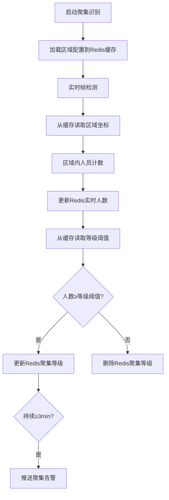

# 三、聚集警告模块（Gathering Warning Module）独立项目PRD
## 1. 基本信息
| 项               | 内容                                                                 |
|------------------|----------------------------------------------------------------------|
| 项目名称         | 聚集警告模块项目                                                     |
| 英文名称         | Gathering Warning Project                                             |
| 版本             | V1.0                                                                 |
| 事件编号         | 04                                                                   |
| RabbitMQ队列     | `warning_gathering`（持久化队列）                                     |
| 输入源           | 本地摄像头 / 本地视频文件（MP4/AVI） / RTSP/HTTP-FLV网络视频流       |
| 技术栈           | Python3.11 + FastAPI + YOLOv12 + ByteTrack + MySQL + RabbitMQ         |
| 环境管理         | conda（environment.yml）+ requirements.txt 兼容                     |
| 项目定位         | 独立子项目，负责区域内人员聚集行为检测与分级告警，后续可无缝集成至总异常行为识别系统 |

## 2. 项目概述
本项目为异常行为识别系统的核心子项目，专注于**指定区域内人员聚集行为监测**：支持多输入源检测，通过YOLOv12+ByteTrack实现区域内人员计数，结合预设三级等级阈值（轻度/中度/紧急），实现聚集分级告警与状态更新，告警信息通过RabbitMQ推送，核心数据持久化至MySQL，为整体系统提供区域聚集异常行为的检测能力。

## 3. 核心功能需求
### 3.1 输入源适配（多模式支持）
| 输入类型       | 具体要求                                                                 |
|----------------|--------------------------------------------------------------------------|
| 本地摄像头     | 支持通过设备ID（如0/1）选择本地摄像头，实时拉取帧流（默认10fps/1080P），支持帧率/分辨率配置 |
| 本地视频文件   | 支持MP4/AVI格式视频上传，按帧解析检测，支持进度回溯与断点续测             |
| 网络视频流     | 支持RTSP/HTTP-FLV协议流地址配置，实时拉取帧流，支持断线重连             |
| 输入源切换     | 提供API `/api/v1/gathering/source/switch`，支持三种输入源一键切换，切换后实时生效 |

### 3.2 聚集区域与等级管理
| 功能点         | 具体要求                                                                 |
|----------------|--------------------------------------------------------------------------|
| 区域定义       | 支持在视频画面中手动框选单个聚集区域，记录坐标（x1,y1,x2,y2），生成唯一区域编号（area_id，如B01） |
| 等级阈值配置   | 固定三级等级阈值（不可自定义）：<br>① 轻度：5人<br>② 中度：10人<br>③ 紧急：20人 |
| 区域管理接口   | 提供增删改查API：<br>- `/api/v1/gathering/area/add`（新增）<br>- `/api/v1/gathering/area/update`（修改）<br>- `/api/v1/gathering/area/delete`（删除）<br>- `/api/v1/gathering/area/query`（查询） |

### 3.3 聚集行为判定逻辑
| 判定规则       | 具体要求                                                                 |
|----------------|--------------------------------------------------------------------------|
| 人员计数       | 基于YOLOv12+ByteTrack实时统计区域内人员总数，过滤非人员目标（如物体、阴影） |
| 聚集判定       | 人员总数达到某等级阈值且持续≥3分钟 → 触发对应等级告警；人数变化导致等级变更 → 实时更新告警 |
| 解除判定       | 人员总数低于轻度阈值（＜5人）且持续≥5分钟 → 解除聚集告警                   |

### 3.4 告警规则与输出
| 告警类型       | 触发时机                                                                 | 输出要求                                                                 |
|----------------|--------------------------------------------------------------------------|--------------------------------------------------------------------------|
| 聚集告警       | 聚集等级生效/等级变更时                                                   | 推送至`warning_gathering`队列，消息格式见下方JSON示例                       |
| 告警解除       | 聚集状态解除时                                                           | 推送至`warning_gathering`队列，`alarm_type`为“聚集告警解除”，补充`alarm_end`字段 |

#### 告警消息格式（JSON示例）
```json
{
  "alarm_time": "2026-03-23 14:40:00",
  "event_id": "04",
  "alarm_type": "聚集告警",
  "content": {
    "area_id": "B01",
    "gathering_count": 12,
    "level": "中度",
    "level_thresholds": {
      "light": 5,
      "medium": 10,
      "urgent": 20
    },
    "duration_min": 3,
    "source_type": "camera",
    "source_id": "CAM01"
  },
  "message_id": "uuid-ghi789"
}
```

## 4. API接口设计（独立项目）
| 接口路径                          | 方法 | 功能               | 请求参数示例                                                                 |
|-----------------------------------|------|--------------------|------------------------------------------------------------------------------|
| `/api/v1/gathering/area/add`      | POST | 新增聚集区域       | `{"area_id":"B01","area_name":"广场区域","coords":"200,300,800,900"}`         |
| `/api/v1/gathering/area/update`   | POST | 修改区域配置       | `{"area_id":"B01","coords":"200,300,850,950"}`                             |
| `/api/v1/gathering/area/delete`   | POST | 删除区域配置       | `{"area_id":"B01"}`                                                         |
| `/api/v1/gathering/area/query`    | GET  | 查询区域列表       | `?area_id=B01`                                                               |
| `/api/v1/gathering/source/switch` | POST | 切换输入源         | `{"source_type":"camera","source_id":"CAM01","device_id":0}`                |
| `/api/v1/gathering/start`         | POST | 启动聚集识别       | `{"source_id":"CAM01"}`                                                     |
| `/api/v1/gathering/stop`          | POST | 停止聚集识别       | -                                                                            |
| `/api/v1/gathering/alarm/list`    | GET  | 查询告警记录       | `?area_id=B01&level=中度&start_time=2026-03-01&end_time=2026-03-23`         |

## 5. 数据库设计（独立项目表结构）
```sql
-- 区域配置表（核心业务表，type=1标识聚集区域）
CREATE TABLE `t_area_gathering` (
  `id` int NOT NULL AUTO_INCREMENT COMMENT '自增ID',
  `area_id` varchar(10) NOT NULL COMMENT '区域编号（唯一）',
  `area_name` varchar(50) NOT NULL COMMENT '区域名称',
  `coords` varchar(200) NOT NULL COMMENT '区域坐标（x1,y1,x2,y2）',
  `level_thresholds` json NOT NULL COMMENT '等级阈值（JSON格式）',
  `is_enable` tinyint DEFAULT 1 COMMENT '1启用/0禁用',
  `create_time` datetime DEFAULT CURRENT_TIMESTAMP COMMENT '创建时间',
  PRIMARY KEY (`id`),
  UNIQUE KEY `uk_area_id` (`area_id`)
) ENGINE=InnoDB DEFAULT CHARSET=utf8mb4 COMMENT='聚集区域配置表';

-- 输入源配置表（与总系统兼容，同前两个模块）
CREATE TABLE `t_video_source` (
  `id` int NOT NULL AUTO_INCREMENT COMMENT '自增ID',
  `source_id` varchar(20) NOT NULL COMMENT '输入源编号',
  `source_name` varchar(50) NOT NULL COMMENT '输入源名称',
  `source_type` varchar(10) NOT NULL COMMENT 'camera/file/stream',
  `device_id` int DEFAULT NULL COMMENT '摄像头设备ID（仅camera类型）',
  `source_addr` text COMMENT '本地路径/网络流地址',
  `is_enable` tinyint DEFAULT 1 COMMENT '1启用/0禁用',
  `create_time` datetime DEFAULT CURRENT_TIMESTAMP COMMENT '创建时间',
  PRIMARY KEY (`id`),
  UNIQUE KEY `uk_source_id` (`source_id`)
) ENGINE=InnoDB DEFAULT CHARSET=utf8mb4 COMMENT='输入源配置表';

-- 告警记录表（核心业务表）
CREATE TABLE `t_alarm_gathering` (
  `id` int NOT NULL AUTO_INCREMENT COMMENT '自增ID',
  `alarm_time` datetime NOT NULL COMMENT '告警时间',
  `event_id` varchar(2) NOT NULL DEFAULT '04' COMMENT '事件编号（固定04）',
  `alarm_type` varchar(20) NOT NULL COMMENT '告警类型（聚集/解除）',
  `content` json NOT NULL COMMENT '告警内容（JSON格式）',
  `source_type` varchar(10) NOT NULL COMMENT '输入源类型',
  `source_id` varchar(20) NOT NULL COMMENT '输入源编号',
  `message_id` varchar(100) NOT NULL COMMENT 'RabbitMQ消息ID（唯一）',
  `status` tinyint DEFAULT 0 COMMENT '0未处理/1已查看',
  `create_time` datetime DEFAULT CURRENT_TIMESTAMP COMMENT '创建时间',
  PRIMARY KEY (`id`),
  UNIQUE KEY `uk_message_id` (`message_id`),
  INDEX `idx_area_id` (`content->>'$.area_id'`),
  INDEX `idx_level` (`content->>'$.level'`),
  INDEX `idx_alarm_time` (`alarm_time`)
) ENGINE=InnoDB DEFAULT CHARSET=utf8mb4 COMMENT='聚集告警记录表';
```

## 6. 非功能需求
| 类别       | 具体要求                                                                 |
|------------|--------------------------------------------------------------------------|
| 性能       | 区域内人员计数误差≤2人；等级判定延迟≤1分钟；摄像头实时检测延迟≤1秒（帧提取+识别）；告警推送延迟≤500ms |
| 可靠性     | 支持视频流断线重连；数据库操作异常自动重试；RabbitMQ消息持久化，消费失败可重试 |
| 易用性     | 提供`README.md`说明环境搭建与运行步骤；接口自动生成Swagger文档（`/docs`） |
| 可扩展性   | 支持后续新增多区域并发检测、等级阈值自定义；接口与总系统保持兼容，便于后续整合 |

## 7. 集成说明
本项目开发完成后，可通过以下方式集成至总异常行为识别系统：
1. 复用`environment.yml`/`requirements.txt`环境配置，与其他模块共享依赖；
2. 数据库表结构与总系统对齐（`t_video_source`/`t_area`/`t_alarm`可合并）；
3. API接口路径保持`/api/v1/gathering/`前缀，与总系统路由兼容；
4. RabbitMQ队列`warning_gathering`直接接入总系统消费端，无需修改消息格式。

---

### 三个独立项目PRD核心差异总结
| 项目名称         | 核心判定维度       | 告警等级/类型       | 核心数据库表               | RabbitMQ队列           |
|------------------|--------------------|--------------------|--------------------------|------------------------|
| 离岗识别项目     | 离岗时长、人员匹配 | 首次/持续/解除告警 | `t_person`/`t_alarm_absent` | `warning_absent`       |
| 徘徊警告项目     | 区域停留时长、人数 | 徘徊/解除告警       | `t_area_loitering`/`t_alarm_loitering` | `warning_loitering` |
| 聚集警告项目     | 区域人数、等级阈值 | 轻度/中度/紧急告警 | `t_area_gathering`/`t_alarm_gathering` | `warning_gathering` |


## 新增小节：8 缓存层设计（Redis）
### 8.1 缓存内容与策略
| 缓存键示例                    | 缓存内容                          | 刷新策略                          | 过期时间 | 业务关联                                                                 |
|-------------------------------|-----------------------------------|-----------------------------------|----------|--------------------------------------------------------------------------|
| `abrs:gathering:area:config`   | 所有聚集区域配置（坐标、等级阈值） | 启动时全量加载+5分钟定时刷新+区域配置更新时主动刷新 | 300秒    | 检测时直接从缓存读取区域坐标/等级阈值，无需查MySQL，保证等级判定实时性     |
| `abrs:gathering:count:B01`     | 区域B01的实时人数                 | 每帧检测更新+聚集状态解除时删除    | 10秒     | 实时统计人数，等级判定直接读取缓存，保证等级更新延迟≤1分钟               |
| `abrs:gathering:level:B01`     | 区域B01的当前聚集等级             | 等级变更时更新+人数低于阈值时删除  | 10秒     | 告警时直接读取缓存等级，避免重复计算，降低告警延迟                       |

### 8.2 缓存与业务流程的关联


### 8.3 缓存降级逻辑
- Redis故障时，降级为直接查询MySQL区域配置表；
- 实时人数/聚集等级降级为内存变量存储；
- 等级判定延迟略有增加（≤2分钟），但核心告警逻辑不受影响。

---


