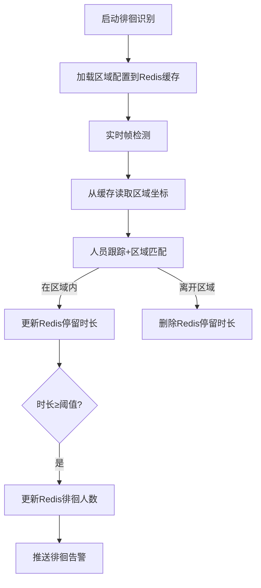

# 二、徘徊警告模块（Loitering Warning Module）独立项目PRD
## 1. 基本信息
| 项               | 内容                                                                 |
|------------------|----------------------------------------------------------------------|
| 项目名称         | 徘徊警告模块项目                                                     |
| 英文名称         | Loitering Warning Project                                             |
| 版本             | V1.0                                                                 |
| 事件编号         | 03                                                                   |
| RabbitMQ队列     | `warning_loitering`（持久化队列）                                     |
| 输入源           | 本地摄像头 / 本地视频文件（MP4/AVI） / RTSP/HTTP-FLV网络视频流       |
| 技术栈           | Python3.11 + FastAPI + YOLOv12 + ByteTrack + MySQL + RabbitMQ         |
| 环境管理         | conda（environment.yml）+ requirements.txt 兼容                     |
| 项目定位         | 独立子项目，负责区域内人员徘徊行为检测与告警，后续可无缝集成至总异常行为识别系统 |

## 2. 项目概述
本项目为异常行为识别系统的核心子项目，专注于**指定区域内人员徘徊行为监测**：支持多输入源检测，通过YOLOv12+ByteTrack实现人员跟踪，统计区域内人员累计停留时长，达到预设阈值后触发徘徊告警并输出徘徊人数，告警信息通过RabbitMQ推送，核心数据持久化至MySQL，为整体系统提供区域徘徊异常行为的检测能力。

## 3. 核心功能需求
### 3.1 输入源适配（多模式支持）
| 输入类型       | 具体要求                                                                 |
|----------------|--------------------------------------------------------------------------|
| 本地摄像头     | 支持通过设备ID（如0/1）选择本地摄像头，实时拉取帧流（默认10fps/1080P），支持帧率/分辨率配置 |
| 本地视频文件   | 支持MP4/AVI格式视频上传，按帧解析检测，支持进度回溯与断点续测             |
| 网络视频流     | 支持RTSP/HTTP-FLV协议流地址配置，实时拉取帧流，支持断线重连             |
| 输入源切换     | 提供API `/api/v1/loitering/source/switch`，支持三种输入源一键切换，切换后实时生效 |

### 3.2 徘徊区域与规则管理
| 功能点         | 具体要求                                                                 |
|----------------|--------------------------------------------------------------------------|
| 区域定义       | 支持在视频画面中手动框选单个徘徊区域，记录坐标（x1,y1,x2,y2），生成唯一区域编号（area_id，如A01） |
| 阈值配置       | 配置徘徊时长阈值（默认10分钟，可自定义），即人员累计停留时长达到该值触发告警 |
| 区域管理接口   | 提供增删改查API：<br>- `/api/v1/loitering/area/add`（新增）<br>- `/api/v1/loitering/area/update`（修改）<br>- `/api/v1/loitering/area/delete`（删除）<br>- `/api/v1/loitering/area/query`（查询） |

### 3.3 徘徊行为判定逻辑
| 判定规则       | 具体要求                                                                 |
|----------------|--------------------------------------------------------------------------|
| 人员跟踪       | 基于YOLOv12+ByteTrack识别区域内人员，为每个人员分配唯一跟踪ID，过滤短暂路过人员（停留＜1分钟） |
| 时长统计       | 累计计算同一跟踪ID在区域内的停留时长（含反复进出的累计时长）|
| 徘徊判定       | 累计时长 ≥ 徘徊时长阈值 → 判定为“徘徊”，触发告警；人员离开区域＞5分钟 → 解除徘徊状态 |

### 3.4 告警规则与输出
| 告警类型       | 触发时机                                                                 | 输出要求                                                                 |
|----------------|--------------------------------------------------------------------------|--------------------------------------------------------------------------|
| 徘徊告警       | 徘徊判定生效/区域内徘徊人数变化时                                         | 推送至`warning_loitering`队列，消息格式见下方JSON示例                       |
| 告警解除       | 区域内无徘徊人员且持续＞5分钟时                                           | 推送至`warning_loitering`队列，`alarm_type`为“徘徊告警解除”，补充`alarm_end`字段 |

#### 告警消息格式（JSON示例）
```json
{
  "alarm_time": "2026-03-23 14:35:00",
  "event_id": "03",
  "alarm_type": "徘徊告警",
  "content": {
    "area_id": "A01",
    "loitering_count": 2,
    "threshold_min": 10,
    "current_duration_min": 10,
    "source_type": "camera",
    "source_id": "CAM01"
  },
  "message_id": "uuid-def456"
}
```

## 4. API接口设计（独立项目）
| 接口路径                          | 方法 | 功能               | 请求参数示例                                                                 |
|-----------------------------------|------|--------------------|------------------------------------------------------------------------------|
| `/api/v1/loitering/area/add`      | POST | 新增徘徊区域       | `{"area_id":"A01","area_name":"北门区域","coords":"100,200,500,600","threshold_min":10}` |
| `/api/v1/loitering/area/update`   | POST | 修改区域配置       | `{"area_id":"A01","threshold_min":15}`                                       |
| `/api/v1/loitering/area/delete`   | POST | 删除区域配置       | `{"area_id":"A01"}`                                                         |
| `/api/v1/loitering/area/query`    | GET  | 查询区域列表       | `?area_id=A01`                                                               |
| `/api/v1/loitering/source/switch` | POST | 切换输入源         | `{"source_type":"camera","source_id":"CAM01","device_id":0}`                |
| `/api/v1/loitering/start`         | POST | 启动徘徊识别       | `{"source_id":"CAM01"}`                                                     |
| `/api/v1/loitering/stop`          | POST | 停止徘徊识别       | -                                                                            |
| `/api/v1/loitering/alarm/list`    | GET  | 查询告警记录       | `?area_id=A01&start_time=2026-03-01&end_time=2026-03-23`                     |

## 5. 数据库设计（独立项目表结构）
```sql
-- 区域配置表（核心业务表，type=0标识徘徊区域）
CREATE TABLE `t_area_loitering` (
  `id` int NOT NULL AUTO_INCREMENT COMMENT '自增ID',
  `area_id` varchar(10) NOT NULL COMMENT '区域编号（唯一）',
  `area_name` varchar(50) NOT NULL COMMENT '区域名称',
  `coords` varchar(200) NOT NULL COMMENT '区域坐标（x1,y1,x2,y2）',
  `threshold_min` int DEFAULT 10 COMMENT '徘徊时长阈值（分钟）',
  `is_enable` tinyint DEFAULT 1 COMMENT '1启用/0禁用',
  `create_time` datetime DEFAULT CURRENT_TIMESTAMP COMMENT '创建时间',
  PRIMARY KEY (`id`),
  UNIQUE KEY `uk_area_id` (`area_id`)
) ENGINE=InnoDB DEFAULT CHARSET=utf8mb4 COMMENT='徘徊区域配置表';

-- 输入源配置表（与总系统兼容，同离岗模块）
CREATE TABLE `t_video_source` (
  `id` int NOT NULL AUTO_INCREMENT COMMENT '自增ID',
  `source_id` varchar(20) NOT NULL COMMENT '输入源编号',
  `source_name` varchar(50) NOT NULL COMMENT '输入源名称',
  `source_type` varchar(10) NOT NULL COMMENT 'camera/file/stream',
  `device_id` int DEFAULT NULL COMMENT '摄像头设备ID（仅camera类型）',
  `source_addr` text COMMENT '本地路径/网络流地址',
  `is_enable` tinyint DEFAULT 1 COMMENT '1启用/0禁用',
  `create_time` datetime DEFAULT CURRENT_TIMESTAMP COMMENT '创建时间',
  PRIMARY KEY (`id`),
  UNIQUE KEY `uk_source_id` (`source_id`)
) ENGINE=InnoDB DEFAULT CHARSET=utf8mb4 COMMENT='输入源配置表';

-- 告警记录表（核心业务表）
CREATE TABLE `t_alarm_loitering` (
  `id` int NOT NULL AUTO_INCREMENT COMMENT '自增ID',
  `alarm_time` datetime NOT NULL COMMENT '告警时间',
  `event_id` varchar(2) NOT NULL DEFAULT '03' COMMENT '事件编号（固定03）',
  `alarm_type` varchar(20) NOT NULL COMMENT '告警类型（徘徊/解除）',
  `content` json NOT NULL COMMENT '告警内容（JSON格式）',
  `source_type` varchar(10) NOT NULL COMMENT '输入源类型',
  `source_id` varchar(20) NOT NULL COMMENT '输入源编号',
  `message_id` varchar(100) NOT NULL COMMENT 'RabbitMQ消息ID（唯一）',
  `status` tinyint DEFAULT 0 COMMENT '0未处理/1已查看',
  `create_time` datetime DEFAULT CURRENT_TIMESTAMP COMMENT '创建时间',
  PRIMARY KEY (`id`),
  UNIQUE KEY `uk_message_id` (`message_id`),
  INDEX `idx_area_id` (`content->>'$.area_id'`),
  INDEX `idx_alarm_time` (`alarm_time`)
) ENGINE=InnoDB DEFAULT CHARSET=utf8mb4 COMMENT='徘徊告警记录表';
```

## 6. 非功能需求
| 类别       | 具体要求                                                                 |
|------------|--------------------------------------------------------------------------|
| 性能       | 区域内人员计数误差≤1人；时长统计误差≤30秒；摄像头实时检测延迟≤1秒（帧提取+识别）；告警推送延迟≤500ms |
| 可靠性     | 支持视频流断线重连；数据库操作异常自动重试；RabbitMQ消息持久化，消费失败可重试 |
| 易用性     | 提供`README.md`说明环境搭建与运行步骤；接口自动生成Swagger文档（`/docs`） |
| 可扩展性   | 支持后续新增多区域并发检测；接口与总系统保持兼容，便于后续整合 |

## 7. 集成说明
本项目开发完成后，可通过以下方式集成至总异常行为识别系统：
1. 复用`environment.yml`/`requirements.txt`环境配置，与其他模块共享依赖；
2. 数据库表结构与总系统对齐（`t_video_source`/`t_area`/`t_alarm`可合并）；
3. API接口路径保持`/api/v1/loitering/`前缀，与总系统路由兼容；
4. RabbitMQ队列`warning_loitering`直接接入总系统消费端，无需修改消息格式。

## 新增小节：8 缓存层设计（Redis）
### 8.1 缓存内容与策略
| 缓存键示例                  | 缓存内容                          | 刷新策略                          | 过期时间 | 业务关联                                                                 |
|-----------------------------|-----------------------------------|-----------------------------------|----------|--------------------------------------------------------------------------|
| `abrs:loitering:area:config` | 所有徘徊区域配置（坐标、时长阈值） | 启动时全量加载+5分钟定时刷新+区域配置更新时主动刷新 | 300秒    | 检测时直接从缓存读取区域坐标，无需查MySQL，保证区域检测实时性             |
| `abrs:loitering:duration:A01:track123` | 跟踪ID123在区域A01的停留时长（分钟） | 每帧检测更新+人员离开区域时删除    | 10秒     | 累计停留时长仅写入缓存，达到阈值后再写库，降低数据库IO                   |
| `abrs:loitering:count:A01`   | 区域A01的徘徊人数                 | 每帧检测更新+徘徊状态解除时删除    | 10秒     | 实时统计徘徊人数，告警时直接读取缓存数据，保证告警信息准确性             |

### 8.2 缓存与业务流程的关联


### 8.3 缓存降级逻辑
- Redis故障时，降级为直接查询MySQL区域配置表；
- 停留时长/徘徊人数降级为内存变量存储；
- 核心检测逻辑不受影响，仅统计精度略降（时长误差≤30s）。

---